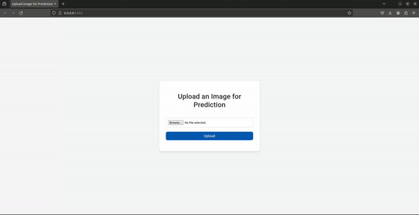

<!-- Improved compatibility of back to top link: See: https://github.com/othneildrew/Best-README-Template/pull/73 -->
<a name="readme-top"></a>
<!--
*** Thanks for checking out the Best-README-Template. If you have a suggestion
*** that would make this better, please fork the repo and create a pull request
*** or simply open an issue with the tag "enhancement".
*** Don't forget to give the project a star!
*** Thanks again! Now go create something AMAZING! :D
-->


<!-- ABOUT THE PROJECT -->
## About The Project
A Web app used upload pictures of dogs and detecting their breeds

<!-- GETTING STARTED -->
## Getting Started
### Installation

1. Need a Roboflow API Key (free, just signup)
2. Clone the repo
   ```sh
   git clone https://github.com/MoMa3/dog_breed_detection.git
   ```
3. ```sh 
    pip install -r requirements.txt
    ```
4. Enter your API in `.env`
   ```js
   const ROBOFLOW_API_KEY = 'ENTER YOUR API';
   ```
5. run app
   ```sh
   python3 app.py
   ```
6. Go to 0.0.0.0:5555 and upload a dog image

<p align="right">(<a href="#readme-top">back to top</a>)</p>



<!-- ROADMAP -->
## Roadmap

- [ ] More Training
- [ ] Better UI
- [ ] Webcam functionality


<p align="right">(<a href="#readme-top">back to top</a>)</p>


<!-- LICENSE -->
## License

Distributed under the MIT License. See `LICENSE.txt` for more information.

<p align="right">(<a href="#readme-top">back to top</a>)</p>


